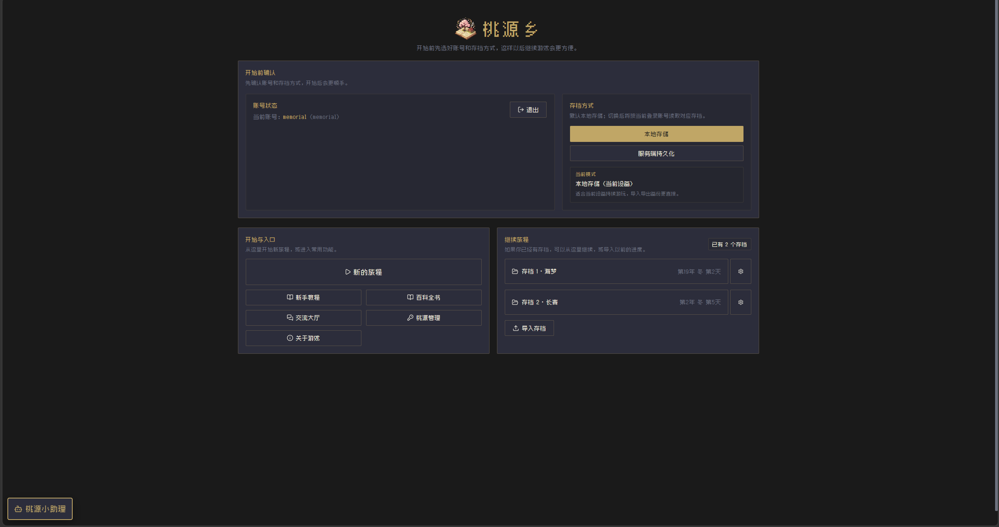
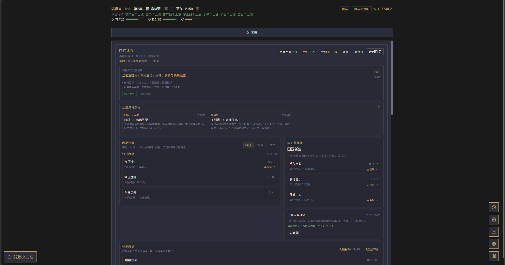
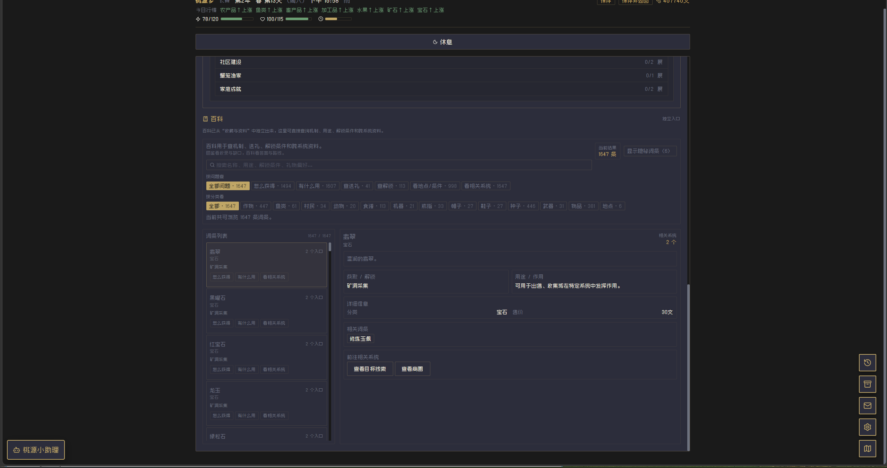
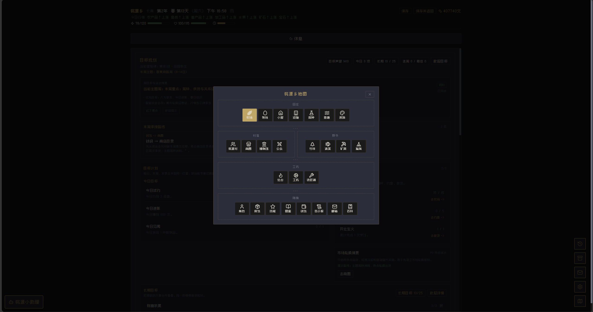

> 在线体验：[立即进入桃源乡独立版](https://taoyuan.ymzcc.com/)  
> 链接地址：`https://taoyuan.ymzcc.com/`

<p align="center">
  
</p>

<h1 align="center">桃源乡独立版</h1>

<p align="center">
  <a href="https://taoyuan.ymzcc.com/" target="_blank">
    
  </a>
  <a href="https://github.com/setube/taoyuan" target="_blank">
    
  </a>
</p>

<p align="center">
  <b>🌟 一个可独立部署的国风田园经营项目 🌟</b><br>
  整合单人经营冒险与账号、云存档、交流大厅、游戏邮箱、AI 小助理等在线能力。
</p>

---

### 🚀 快速访问

> [!IMPORTANT]
> **在线游玩地址**：[https://taoyuan.ymzcc.com/](https://taoyuan.ymzcc.com/)  
> **官方交流群**：1094297186 (QQ)

---
<p align="center">
  <a href="游戏简介.md">玩家向简介</a> ·
  <a href="https://taoyuan.ymzcc.com/guide.html">新手教程</a> ·
  <a href="https://taoyuan.ymzcc.com/guide-book.html">系统百科</a> ·
  <a href="https://github.com/setube/taoyuan">参考仓库</a> ·
  QQ 群：1094297186
</p>

<p align="center">
  <code>国风田园经营</code>
  <code>单人冒险</code>
  <code>任务板 / 主题周 / 周结算</code>
  <code>鱼塘 / 育种 / 博物馆 / 公会 / 瀚海</code>
  <code>Docker / Compose</code>
</p>

## 项目定位

| 项目 | 说明 |
| --- | --- |
| 游戏定位 | 国风田园经营 + 探索冒险 + 关系养成 + 独立版在线能力 |
| 核心体验 | 单人经营仍然是主轴，在线能力负责账号、持久化和辅助社交 |
| 适用场景 | 本地自用、局域网试跑、朋友小范围共享、自建公网服务 |
| 默认端口 | 单端口 `4013` |
| 前端目录 | `taoyuan-main/` |
| 后端目录 | `server/` |
| 数据目录 | `data/` |
| 部署方式 | 本地启动、Docker、Docker Compose |

## 文档导航
- 想直接试玩线上版本：访问 [在线体验](https://taoyuan.ymzcc.com/)
- 想先判断游戏是不是你喜欢的类型：阅读 [游戏简介.md](游戏简介.md)
- 想快速理解当前版本的开局路线：阅读 https://taoyuan.ymzcc.com/guide.html
- 想按系统查看更细的机制分工：阅读 https://taoyuan.ymzcc.com/guide-book.html
- 想先把项目跑起来：阅读下面的 `快速开始`
- 想部署到服务器：阅读 `Docker 与 Compose 部署`
- 想改代码、联调或二开：阅读 `开发者说明`
## 游戏特色

- **不是只靠种地撑全程**：除了田庄经营，还有矿洞、公会、鱼塘、育种、博物馆、瀚海、关系线和隐藏仙灵等多条成长线
- **当前版本更强调“任务给方向”**：主线、告示板、委托、特殊订单、主题周、周结算会一起推动经营节奏
- **六种田庄带来不同开局**：桃源、草甸、溪流、竹林、山丘、荒野会明显影响前几天的体验手感
- **中后期系统已经成型**：鱼塘有周赛和展示池，育种有谱系与认证，公会和博物馆也都有完整承接
- **独立版在线能力可单独部署**：支持注册登录、账号云存档、交流大厅、游戏邮箱、AI 小助理

如果你想看更完整的玩家向介绍，建议直接打开 [游戏简介.md](游戏简介.md)。

## 游戏截图

<p align="center">
  
  
</p>

<p align="center">
  
  
</p>

## 快速开始

如果你只是想先把游戏跑起来，而不是立刻参与源码开发，推荐优先使用已经构建好的 GHCR 镜像。这样不需要先在本地构建前端，也不需要先安装前后端依赖。

项目容器内默认监听 **4013**，下面的快速启动示例会把宿主机端口映射为 **4014**：

- 容器内由 `server` 同时提供网页和 `/api`
- 数据目录建议持久化挂载到 `/app/data`

---

### 一、最快启动流程（推荐：直接拉取镜像）

```bash
docker pull ghcr.io/memorial-coder/taoyuan-duli:latest

docker run -d \
  --name taoyuan \
  -p 4014:4013 \
  -e SECRET_KEY=请替换成至少24位随机长字符串 \
  -e ADMIN_TOKEN=请替换成至少12位管理员口令 \
  -e SUPER_ADMIN_TOKEN=请替换成至少12位超级管理员口令 \
  -e COOKIE_SECURE=false \
  -e COOKIE_SAME_SITE=lax \
  -v taoyuan-duli-data:/app/data \
  ghcr.io/memorial-coder/taoyuan-duli:latest
```

启动完成后，打开：

```text
http://127.0.0.1:4014
```

补充说明：

- 上面的示例适合本机直接体验；如果后面要挂 HTTPS 域名或反向代理，再补充 `CORS_ALLOWED_ORIGINS`、`COOKIE_SECURE=true` 等生产配置
- 命名卷 `taoyuan-duli-data` 会保存账号、会话、存档等运行数据，删除容器后数据仍可保留

---

### 二、本地源码启动（适合二次开发和排查问题）

如果你需要修改前端或后端代码，或者想更方便地定位构建问题，可以改用下面的源码启动方式。

#### 启动前你需要准备什么

请先确认你的电脑已经安装：

- Node.js
- npm

建议使用较新的 Node.js LTS 版本。如果你已经能在终端里运行 `node -v` 和 `npm -v`，一般就可以继续。

#### 第 1 步：构建前端页面

在项目根目录打开终端，执行：

```bash
cd taoyuan-main
npm install
npm run build
```

这一步会把游戏前端页面构建到 `taoyuan-main/docs`。构建完成后，后端才能把网页提供给浏览器打开。

#### 第 2 步：准备后端配置文件

继续在终端里执行：

```bash
cd ../server
copy .env.example .env
```

然后请用编辑器打开 `server/.env`，至少修改下面几项：

- `SECRET_KEY`：改成你自己的随机长字符串
- `ADMIN_TOKEN`：改成你自己的管理员口令
- `SUPER_ADMIN_TOKEN`：如果你需要超级管理员，也改成自己的；不需要可以先留空

其他配置先保持默认也可以，第一次启动不用一次改完所有项。

> 注意：玩家登录密码不是在 `.env` 里写死的，而是玩家在注册页面自己设置。

#### 第 3 步：启动后端

还在 `server` 目录里，执行：

```bash
npm install
npm start
```

看到服务成功启动后，打开浏览器访问：

```text
http://127.0.0.1:4013
```

如果一切正常，你就能看到游戏首页。

#### 第 4 步：第一次进入后建议做什么

第一次打开后，建议按下面顺序体验：

1. 先注册一个账号或登录
2. 选择存档方式
3. 开始新的旅程
4. 优先跟主线、任务页和告示板推进
5. 之后再体验云存档、交流大厅、游戏邮箱和 AI 小助理等独立版功能

## Docker 与 Compose 部署

默认推荐部署路线只有一条：`公开 GHCR 镜像 + Docker Compose`。其他方式只在你有额外需求时再用。

### 怎么选

- 服务器部署：优先用 `GHCR 镜像 + Compose`
- 想自己控制构建过程：用 `Dockerfile` 本机构建
- 服务器不能直接拉镜像：导出 `tar` 再上传
- 想每次推送代码自动产出镜像：用 GitHub Actions
- 已有本地基础镜像，只想快速回填代码：用 `Dockerfile.repack`

### 推荐方案：GHCR 镜像 + Compose

1. 把 `.env.compose.example` 复制为根目录 `.env`，至少修改：

- `SECRET_KEY`
- `ADMIN_TOKEN`
- `SUPER_ADMIN_TOKEN`

2. 服务器目录建议保持为：

```text
/opt/lucky-test/
  ├─ docker-compose.yml
  ├─ .env
  └─ data/
```

3. 使用下面的 `docker-compose.yml`：

```yaml
services:
  taoyuan:
    image: ghcr.io/memorial-coder/taoyuan-duli:latest
    container_name: taoyuan
    restart: unless-stopped
    env_file:
      - .env
    environment:
      DB_STORAGE: /app/data/.storage.json
    ports:
      - "${HOST_PORT:-4014}:4013"
    volumes:
      - ./data:/app/data
```

4. 启动或更新：

```bash
cd /opt/lucky-test
docker compose pull
docker compose up -d
```

5. 检查是否正常：

```bash
curl http://127.0.0.1:4014/api/health
```

补充说明：

- 容器内服务固定监听 `4013`，对外通常映射为 `4014`
- **必须**挂载 `/app/data`
- 如果你要接 HTTPS 域名或反向代理，再补 `CORS_ALLOWED_ORIGINS`、`COOKIE_SECURE`、`COOKIE_SAME_SITE`
- 如果你要用 MySQL，再补 `MYSQL_HOST / MYSQL_PORT / MYSQL_USER / MYSQL_PASSWORD / MYSQL_DATABASE`

### 其他部署方式

#### 自行构建镜像

适合你想完全自己控制构建过程时使用。

```bash
docker build -t taoyuan-duli:latest .
```

如果要继续用 Compose，直接把上面推荐配置里的 `image:` 改成：

```yaml
image: taoyuan-duli:latest
```

#### 三、离线部署：导出 tar 再上传

适合服务器不能直接拉取镜像时使用。

导出镜像：

```bash
docker save -o taoyuan-duli-latest.tar taoyuan-duli:latest
```

服务器上执行：

```bash
cd /opt/lucky-test
docker load -i taoyuan-duli-latest.tar
docker compose up -d
```

这里的 `docker-compose.yml` 仍然沿用上一节推荐配置，只需要把 `image:` 改成 `taoyuan-duli:latest`。

#### GitHub Actions 自动发布 GHCR

如果仓库维护者希望在每次推送代码后，由 GitHub 自动构建镜像并发布，而不是在本地手动执行 `docker build`，可以使用仓库里的工作流文件：

- `.github/workflows/docker-publish.yml`

当前工作流会在以下条件下触发：

- 推送到 `main`
- 且改动包含 `Dockerfile`、`.dockerignore`、`server/**`、`taoyuan-main/**`、`data-defaults/**` 或工作流文件本身
- 或者在 GitHub 网页手动执行 `Run workflow`

启用前请先在 GitHub 仓库页面打开：

- `Settings -> Actions -> General -> Workflow permissions`

并将权限设为：

- `Read and write permissions`

这样工作流里的 `GITHUB_TOKEN` 才能把镜像推送到 GitHub Container Registry。

推送成功后，镜像会发布到：

```text
ghcr.io/memorial-coder/taoyuan-duli:latest
```

之后每次代码推送到 `main`，维护者就**不需要再手动构建镜像**了。服务器只需要：

```bash
cd /opt/lucky-test
docker compose pull
docker compose up -d
```

#### 高级用法：`Dockerfile.repack`

仓库根目录默认的 `docker-compose.yml` 面向这个流程。它会基于你本机已经存在的 `taoyuan-duli:latest` 镜像，只覆盖：

- `server/`
- `taoyuan-main/docs`
- `data-defaults/`

这种方式适合“本地代码已改好，但当前网络不方便重新拉取 Docker Hub 基础镜像”的场景，能让前端静态资源和后端代码快速进入容器。

对应配置类似：

```yaml
services:
  taoyuan:
    build:
      context: .
      dockerfile: Dockerfile.repack
    image: taoyuan-duli:latest
```

如果你希望从头完整重建镜像，可以把 `docker-compose.yml` 里的 `dockerfile` 改回 `Dockerfile`，再执行：

```bash
docker compose up -d --build
```

如果你不是在做本地快速回填，而是在做正式服务器部署，优先回到上面的 GHCR 路线。

## 技术栈

| 模块 | 技术 | 说明 |
| --- | --- | --- |
| 前端框架 | Vue 3.5 + Pinia + Vue Router | 游戏界面、状态管理、页面路由 |
| 构建与类型 | Vite 7 + TypeScript 5.9 | 前端构建、类型检查、开发联调 |
| 样式 | TailwindCSS 3 + 原生 CSS | UI 布局与样式组织 |
| 后端服务 | Express 4 + express-session + Helmet + CORS | 登录、存档、大厅、邮箱、AI 助手接口 |
| 数据存储 | 本地文件用户库 / MySQL2 | 支持本地文件与 MySQL 两种账号模式 |
| 多端能力 | Electron + Capacitor | 桌面打包与 Android 构建能力已在前端目录中保留 |
| 部署 | Docker + Docker Compose | 本地、服务器、自定义镜像部署 |

## 项目结构

```text
.
├─ taoyuan-main/              # 前端源码、静态资源、构建产物
│  ├─ src/                    # 游戏前端源码
│  ├─ public/                 # 新手教程、系统百科等静态文件
│  ├─ images/                 # README / 宣传图等素材
│  ├─ docs/                   # Vite 构建输出目录
│  └─ package.json            # 前端脚本与依赖
├─ server/                    # 独立版后端
│  ├─ src/                    # API、会话、存档、大厅、邮箱、AI 助手
│  ├─ .env.example            # 后端配置示例
│  └─ package.json            # 后端脚本与依赖
├─ data/                      # 运行时数据
├─ data-defaults/             # 默认配置与初始数据
├─ tools/                     # 辅助工具脚本
├─ docker-compose.yml         # 默认 Compose 入口（本地 repack 流程）
├─ Dockerfile                 # 完整构建镜像
├─ Dockerfile.repack          # 基于现有镜像快速回填构建
├─ .env.compose.example       # Compose 环境变量示例
├─ 游戏简介.md                # 玩家向介绍
└─ README.md                  # 项目入口说明
```

## 游戏系统一览

| 系统 | 定位 | 当前特点 |
| --- | --- | --- |
| 田庄 / 种植 | 开局保底经营线 | 六种田庄、轮作种植、设施升级、稳定现金流 |
| 牧场 / 家园 | 日常经营扩展线 | 动物照料、产物维护、宅院布置与生活化体验 |
| 钓鱼 / 鱼塘 | 中期经营线 | 钓鱼补现金流、鱼塘周赛、展示池、高阶养护 |
| 矿洞 / 公会 | 冒险成长线 | 矿石素材、战斗推进、讨伐、捐献、荣誉与赛季 |
| 育种 | 中后期实验线 | 谱系、认证、图鉴、品鉴周赛、规划器 |
| 博物馆 | 收藏与展陈线 | 展陈评分、馆务推进、学者委托、长期收集目标 |
| 瀚海 | 高阶段商路线 | 商路投资、遗迹勘探、轮换货架、异域经营 |
| 村民 / 婚姻 / 仙灵 | 关系与奇遇线 | 送礼、恋爱、婚姻、仙缘与长期加成 |
| 在线功能 | 独立版差异能力 | 登录、云存档、交流大厅、邮箱、AI 小助理 |

## 部署配置速查

部署时主要看根目录 `.env`。如果你是本地源码直跑，再另外参考 `server/.env.example`。

### 根目录 `.env` 常用配置

| 配置项 | 是否常用 | 作用 | 常见说明 |
| --- | --- | --- | --- |
| `HOST_PORT` | 是 | 映射到宿主机的端口 | 常见为 `4014`、`80`、`443` 后的反代入口 |
| `SECRET_KEY` | 是 | 传给容器内服务的会话密钥 | 规则同上 |
| `ADMIN_TOKEN` | 是 | 传给容器内服务的管理员口令 | 规则同上 |
| `SUPER_ADMIN_TOKEN` | 否 | 超级管理员口令 | 可留空 |
| `CORS_ALLOWED_ORIGINS` | 通常是 | 允许跨域携带 Cookie 的来源 | 生产环境建议填写真实域名 |
| `COOKIE_SECURE` | 生产环境建议开启 | 控制 HTTPS Cookie | 与反向代理配置一起考虑 |
| `COOKIE_SAME_SITE` | 视跨域策略 | Cookie 跨站策略 | 跨站登录常见为 `none` |
| `MYSQL_HOST / MYSQL_PORT / MYSQL_USER / MYSQL_PASSWORD / MYSQL_DATABASE` | 否 | MySQL 用户库配置 | 不使用 MySQL 时留空即可 |

## 上线检查清单

- 不要直接使用示例 `SECRET_KEY`、`ADMIN_TOKEN`、`SUPER_ADMIN_TOKEN`
- 不要把根目录 `.env` 或 `server/.env` 提交到仓库
- 生产环境建议通过 HTTPS 反向代理暴露服务
- 若使用跨站 Cookie，确保 `COOKIE_SAME_SITE=none` 时同时启用 `COOKIE_SECURE=true`
- 确认 `CORS_ALLOWED_ORIGINS` 填写的是实际访问地址，而不是临时测试地址
- 确认数据卷已挂载到 `/app/data`
- 若使用 MySQL，额外备份数据库，不要只备份容器

## 部署运维

- `data/` 目录或容器挂载的数据卷
- 当前使用的 `.env`
- 若启用了 MySQL，再额外备份数据库
- 如有自定义部署脚本，也一并备份

### 升级

1. 先备份 `data/`、`.env` 和数据库
2. 准备新镜像，或等待 GitHub Actions 推送新的 GHCR 镜像，或在目标机器上构建新镜像
3. 保持数据挂载目录不变
4. 执行 `docker compose down` 后再 `docker compose up -d`
5. 用 `/api/health` 和实际登录流程确认升级成功

### 恢复

1. 停掉当前容器
2. 还原旧数据目录或旧数据库
3. 还原旧配置文件
4. 重新加载旧镜像并启动
5. 检查首页、登录、存档和后台入口是否正常

## 常用运维命令

查看容器状态：

```bash
docker compose ps
```

查看实时日志：

```bash
docker logs -f taoyuan
```

检查健康接口：

```bash
curl http://127.0.0.1:4014/api/health
```

重建并启动：

```bash
docker compose up -d --build
```

停止并移除当前服务：

```bash
docker compose down
```

如果你当前是本地直接运行模式，后端启动命令是：

```bash
cd server
npm start
```

## 开发者说明

如果你要继续开发、二开或本地联调，可以把前后端分开运行。

### 前端开发

```bash
cd taoyuan-main
npm install
npm run dev
```

常用命令：

- `npm run build`：构建生产静态资源到 `taoyuan-main/docs`
- `npm run lint`：执行前端 lint
- `npm run type-check`：执行 TypeScript 检查
- `npm run qa:late-game`：执行较完整的后期样本与静态检查流程

### 后端开发

```bash
cd server
npm install
npm run dev
```

常用命令：

- `npm start`：普通启动
- `npm run dev`：使用 `node --watch` 监听改动

### 联调与构建说明

- 正式对外服务时，`server` 会优先提供 `taoyuan-main/docs` 下的静态页面
- 如果你改的是前端页面，记得重新执行 `taoyuan-main` 下的 `npm run build`
- 如果你只改了后端接口，重新启动 `server` 或容器即可
- 如果你使用的是 `Dockerfile.repack` 流程，前端修改只有在重新构建 `docs` 后才会进入镜像

## 常见问题

### 打开网页失败

先检查两件事：

- 你有没有先执行 `npm run build`
- 你现在是不是已经在 `server` 目录里执行了 `npm start`

### 构建了前端，但页面还是旧的

优先排查这几项：

- 你是否重新执行了 `taoyuan-main` 下的 `npm run build`
- 你是否只是 `docker compose up -d`，但没有重新构建镜像
- 你当前是否仍在使用旧的 `taoyuan-duli:latest` 镜像

### 端口被占用

如果 `4013` 被别的程序占用了，可以修改 `server/.env` 里的 `PORT`。如果你用的是 Compose，则修改根目录 `.env` 里的 `HOST_PORT`。

### 登录或 Cookie 异常

先优先检查：

- `SECRET_KEY` 有没有改掉示例值
- `CORS_ALLOWED_ORIGINS` 是否和你的访问地址一致
- 跨站部署时是否正确设置了 `COOKIE_SECURE` 与 `COOKIE_SAME_SITE`

### 数据丢失

如果你是本地直接运行，通常数据会保存在本地运行目录。

如果你是用 Docker 运行，必须挂载 `/app/data`，否则重建容器后数据会丢失。

### 想继续使用本地文件用户库，而不是 MySQL

不要填写 `MYSQL_HOST / MYSQL_PORT / MYSQL_USER / MYSQL_PASSWORD / MYSQL_DATABASE`，后端会自动回退到本地文件用户库。

## 交流与参考

- 玩家向简介：[游戏简介.md](游戏简介.md)
- 新手教程：https://taoyuan.ymzcc.com/guide.html
- 系统百科：https://taoyuan.ymzcc.com/guide-book.html
- 参考仓库：<https://github.com/setube/taoyuan>
- 用户 QQ 群：1094297186

## 默认说明

- 用户可在游戏首页自行注册/登录
- 请务必在 `.env` 中自定义管理员口令与会话密钥，不要直接使用示例值
- 如配置了 `SUPER_ADMIN_TOKEN`，则可启用“普通管理员 / 超级管理员”双角色
- 游戏默认使用本地存档，也支持账号云存档

---

## ⚖️ 开源声明与版权说明

本仓库代码遵循 **[MIT](LICENSE)** 开源协议，但在使用与分流时请遵守以下约定：

1. **注明出处**：若您引用本项目的核心代码、美术素材或在此基础上进行二次开发，**必须**在您的项目说明文档（README）或显著位置保留指向本仓库的链接。
2. **禁止商用**：未经原作者书面许可，严禁将本项目（及其修改版本）用于任何形式的商业盈利行为（包括但不限于出售游戏激活码、内置付费充值、商业授权等）。
3. **转载要求**：任何个人或组织在第三方平台（如 Bilibili、知乎、CSDN、个人博客等）转载、解说或发布本项目的相关教程、源码分析时，**必须显著注明出处及原作者信息**。

> [!CAUTION]
> **尊重开源，始于致敬。** 桃源乡的每一行代码都倾注了开发者的心血，请在遵守协议的前提下进行交流与学习。
