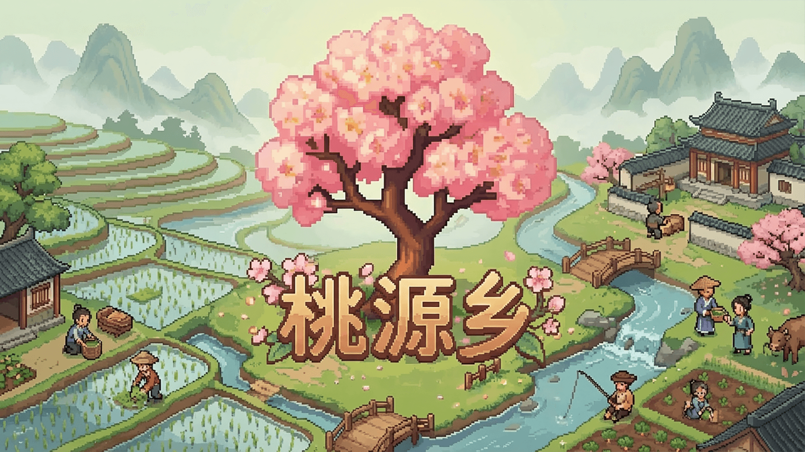
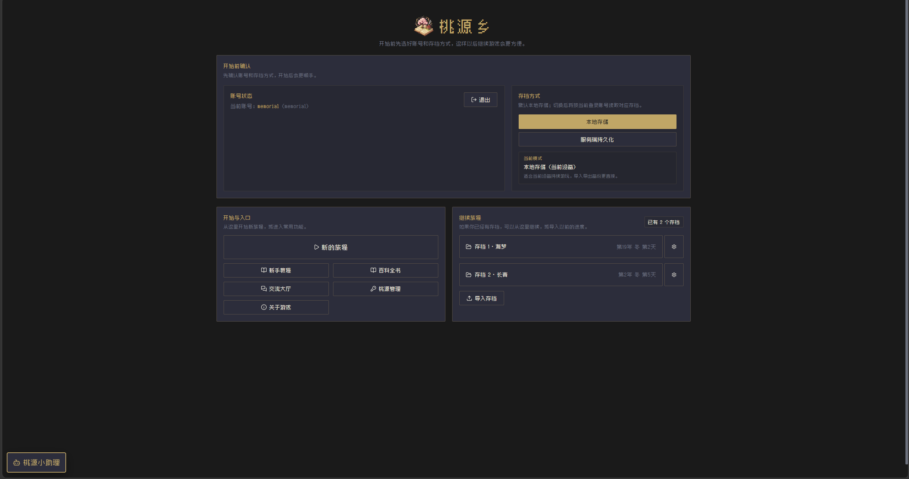
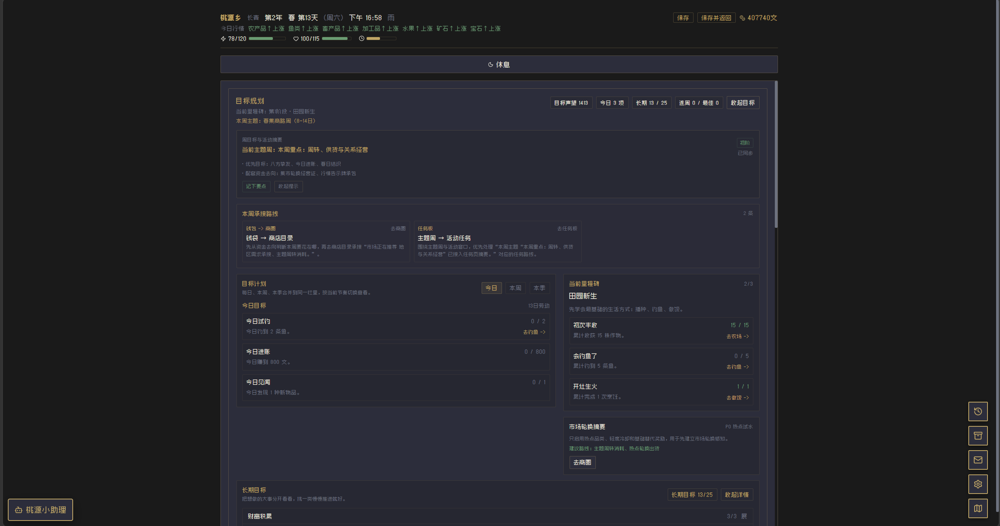
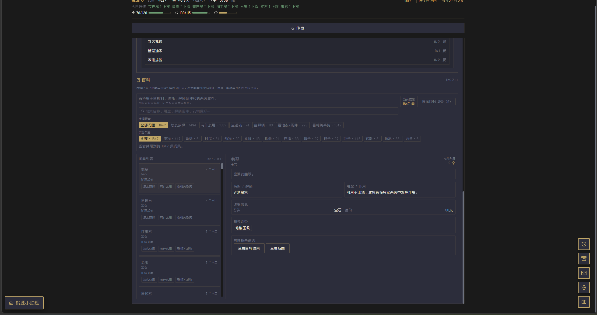
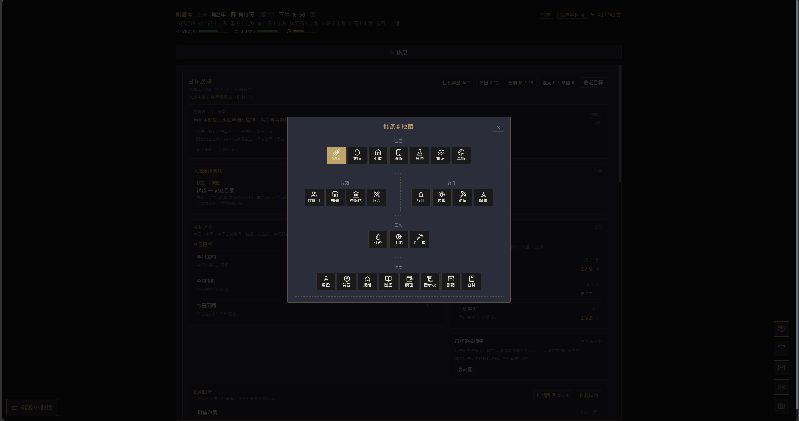

> 在线体验：[立即进入桃源乡独立版](http://taoyuanxiang.ymzcc.com/)  
> 链接地址：`http://taoyuanxiang.ymzcc.com/`

<p align="center">
  
</p>

<h1 align="center">桃源乡独立版</h1>

<p align="center">
  <a href="http://taoyuanxiang.ymzcc.com/" target="_blank">
    
  </a>
  <a href="https://github.com/setube/taoyuan" target="_blank">
    
  </a>
</p>

<p align="center">
  <b>🌟 一个可独立部署的国风田园经营项目 🌟</b><br>
  整合单人经营冒险、长线内容成长、联机协作玩法、账号云存档、AI 小助理与后台治理能力。
</p>

---

### 🚀 快速访问

> [!IMPORTANT]
> **在线游玩地址**：[http://taoyuanxiang.ymzcc.com/](http://taoyuanxiang.ymzcc.com/)
> **官方交流群**：1094297186 (QQ)

---
<p align="center">
  <a href="游戏简介.md">玩家向简介</a> ·
  <a href="http://taoyuanxiang.ymzcc.com/guide.html">新手教程</a> ·
  <a href="http://taoyuanxiang.ymzcc.com/guide-book.html">系统百科</a> ·
  <a href="https://github.com/setube/taoyuan">参考仓库</a> ·
  QQ 群：1094297186
</p>

<p align="center">
  <code>国风田园经营</code>
  <code>单人冒险</code>
  <code>任务板 / 主题周 / 记录中心</code>
  <code>鱼塘 / 育种 / 博物馆 / 公会 / 瀚海</code>
  <code>在线庄园 / 村社 / 委托 / 节会房</code>
  <code>AI 助理 / 内容治理</code>
  <code>Docker / Compose</code>
</p>

## 项目定位

| 项目 | 说明 |
| --- | --- |
| 游戏定位 | 国风田园经营 + 探索冒险 + 关系养成 + 独立版在线能力 |
| 核心体验 | 单人经营仍然是主轴，任务、周目标、记录中心和多条长线系统负责持续推进 |
| 在线能力 | 账号云存档、交流大厅、邮箱、AI 助手、在线庄园、村社、委托、节会房与远征房 |
| 适用场景 | 本地自用、局域网试跑、朋友小范围共享、自建公网服务 |
| 默认端口 | 单端口 `4013` |
| 前端目录 | `taoyuan-main/` |
| 后端目录 | `server/` |
| 数据目录 | `data/` |
| 部署方式 | 本地启动、Docker、Docker Compose |

## 文档导航
- 想直接试玩线上版本：访问 [在线体验](http://taoyuanxiang.ymzcc.com/)
- 想先判断游戏是不是你喜欢的类型：阅读 [游戏简介.md](游戏简介.md)
- 想准备 `v3.0.0` 发布公告：阅读 [RELEASE_3.0.0.md](RELEASE_3.0.0.md)
- 想查看最近内容和系统更新：阅读 [CHANGELOG.md](CHANGELOG.md)
- 想快速理解当前版本的开局路线：阅读 https://taoyuan.ymzcc.com/guide.html
- 想按系统查看更细的机制分工：阅读 https://taoyuan.ymzcc.com/guide-book.html
- 想了解联机系统拆分与状态机：阅读 [docs/online/README.md](docs/online/README.md)
- 想继续接入物品图标或 NPC 图片：阅读 [images/item/plan.md](images/item/plan.md) 与 [全NPC图片嵌入游戏计划.md](全NPC图片嵌入游戏计划.md)
- 想先把项目跑起来：阅读下面的 `快速开始`
- 想部署到服务器：阅读 `Docker 与 Compose 部署`
- 想改代码、联调或二开：阅读 `开发者说明`

## 游戏特色

- **不是只靠种地撑全程**：除了田庄经营，还有矿洞、公会、鱼塘、育种、博物馆、瀚海、行旅图、关系线和隐藏仙灵等多条成长线
- **当前版本更强调“任务给方向”**：主线、告示板、委托、特殊订单、主题周、周结算、记录中心会一起推动经营节奏
- **六种田庄带来不同开局**：桃源、草甸、溪流、竹林、山丘、荒野会明显影响前几天的体验手感
- **中后期系统已经成型**：鱼塘有周赛和展示池，育种有谱系与认证，公会、博物馆、瀚海和区域远征都能承接长期目标
- **独立版在线能力已经扩展成一组玩法**：除了注册登录、云存档、大厅、邮箱、AI 助理，还包含在线庄园、邻里、村社、在线委托、节会房、远征房和共同庄园
- **内容运营和安全治理更完整**：服务端文本 / 图片审核、举报处置、风险发现、后台审计、AI 助手安全边界和管理端治理面板已经接入

如果你想看更完整的玩家向介绍，建议直接打开 [游戏简介.md](游戏简介.md)。

## 当前内容进展

| 方向 | 当前状态 |
| --- | --- |
| 单人经营 | 种植、牧场、钓鱼、采集、加工、烹饪、工具升级、家园布置和钱包预算构成日常循环 |
| 中后期目标 | 鱼塘、育种、博物馆、公会、瀚海、行旅图、区域远征、前线纪事和记录中心继续提供长期追求 |
| 叙事与探索 | 村民关系、婚恋家庭、隐藏仙灵、秘密纸条、时历事件、稀有来访和故事场景资源已经接入或进入资产管线 |
| 视觉资源 | 主视觉、区域头图、节庆场景、故事插图、物品图标管线和 NPC 图片管线已经形成独立素材与压缩运行时方案 |
| 在线玩法 | 在线中心、在线庄园、邻里、村社、在线委托、共同庄园、节会房、在线远征房和独立远征房正在按正式交互收口 |
| 运营治理 | 内容审核、举报处置、后台审计、风险信号、日志留存、交易幂等、AI 助手安全与后台配置审计已补齐主要链路 |

## 场景印象

<p align="center">
  
</p>

## 游戏截图

<p align="center">
  
  
</p>

<p align="center">
  
  
</p>

<p align="center">
  
  
  
</p>

<p align="center">
  
  
  
</p>

### 部署指南

### 前置条件
- 若选择docker启动，请确保已安装 Docker（建议 20.10 以上）并确保 Docker Daemon 正常运行。
- 若选择本地源码启动，请确保已安装 Node.js（LTS 版本）和 npm。

---

### 方式一：快速启动（使用 GHCR 镜像）【推荐】
一行命令即可运行，省去本地依赖安装和前端编译。

```bash
docker pull ghcr.io/memorial-coder/taoyuan-duli:latest

docker run -d \
  --name taoyuan \
  -p 4014:4013 \
  -e SECRET_KEY=请替换为至少24位随机字符串 \
  -e ADMIN_TOKEN=请替换为管理员口令 \
  -e SUPER_ADMIN_TOKEN=如需可填入超级管理员口令 \
  -e COOKIE_SECURE=false \
  -e COOKIE_SAME_SITE=lax \
  -v taoyuan-duli-data:/app/data \
  ghcr.io/memorial-coder/taoyuan-duli:latest
```

访问 `http://127.0.0.1:4014` 即可看到游戏。生产环境请在运行前添加 `CORS_ALLOWED_ORIGINS`、`COOKIE_SECURE=true` 等安全配置。

---

### 方式二：本地源码启动（适合二次开发）
1. **准备环境**：确保已安装 Node.js（建议 LTS）和 npm。
2. **构建前端**：

```bash
cd taoyuan-main
npm install
npm run build   # 输出至 taoyuan-main/docs
```
3. **配置后端**：

```bash
cd ../server
copy .env.example .env
```

在 `server/.env` 中至少修改：
- `SECRET_KEY`：随机长字符串
- `ADMIN_TOKEN`：管理员口令
- `SUPER_ADMIN_TOKEN`（可选）
4. **启动后端**：

```bash
npm install
npm start
```

服务启动后，打开 `http://127.0.0.1:4013` 访问游戏。确保 `taoyuan-main/docs` 已完成构建，否则前端页面将无法展示。

---

### 方式三：Docker Compose 部署（适合服务器）
创建根目录 `.env`（复制 `.env.compose.example`），并填写 `SECRET_KEY`、`ADMIN_TOKEN`、`SUPER_ADMIN_TOKEN`（如需）。

目录结构示例：

```text
/opt/taoyuan/
  ├─ docker-compose.yml
  ├─ .env
  └─ data/   # 用于持久化 /app/data
```

`docker-compose.yml` 示例：

```yaml
services:
  taoyuan:
    image: ghcr.io/memorial-coder/taoyuan-duli:latest
    container_name: taoyuan
    restart: unless-stopped
    env_file: [.env]
    environment:
      DB_STORAGE: /app/data/.storage.json
    ports:
      - "${HOST_PORT:-4014}:4013"
    volumes:
      - ./data:/app/data
      # 如需像物品图标一样从宿主机热更新静态图，可打开下面两行
      # - ./item:/opt/taoyuan/item:ro
      # - ./npc:/opt/taoyuan/npc:ro
```

启动或更新：

```bash
cd ......./taoyuan
docker compose pull        # 拉取最新镜像
docker compose up -d       # 启动或重启服务
```

健康检查：

```bash
curl http://127.0.0.1:4014/api/health
```


---


## 技术栈

| 模块 | 技术 | 说明 |
| --- | --- | --- |
| 前端框架 | Vue 3.5 + Pinia + Vue Router | 游戏界面、状态管理、页面路由 |
| 构建与类型 | Vite 7 + TypeScript 5.9 | 前端构建、类型检查、开发联调 |
| 样式 | TailwindCSS 3 + 原生 CSS | UI 布局与样式组织 |
| 后端服务 | Express 4 + express-session + Helmet + CORS | 登录、存档、大厅、邮箱、AI 助手、在线玩法、审核与治理接口 |
| 数据存储 | 本地文件用户库 / MySQL2 | 支持本地文件与 MySQL 两种账号模式，并保留审计、风险、审核事件等运行数据 |
| 多端能力 | Electron + Capacitor | 桌面打包与 Android 构建能力已在前端目录中保留 |
| 部署 | Docker + Docker Compose | 本地、服务器、自定义镜像部署 |

## 项目结构

```text
.
├─ taoyuan-main/              # 前端源码、静态资源、构建产物
│  ├─ src/                    # 游戏前端源码
│  ├─ public/                 # 新手教程、系统百科等静态文件
│  ├─ images/                 # README / 宣传图等素材
│  ├─ docs/                   # Vite 构建输出目录
│  └─ package.json            # 前端脚本与依赖
├─ server/                    # 独立版后端
│  ├─ src/                    # API、会话、存档、大厅、邮箱、在线玩法、AI 助手、内容治理
│  ├─ .env.example            # 后端配置示例
│  └─ package.json            # 后端脚本与依赖
├─ data/                      # 运行时数据
├─ data-defaults/             # 默认配置、初始数据、审核规则与样例存档
├─ docs/online/               # 在线玩法状态机、发布和扩展文档
├─ images/                    # 原始素材、物品图标和 NPC 图片资产计划
├─ tools/                     # 辅助工具脚本
├─ docker-compose.yml         # 默认 Compose 入口（本地 repack 流程）
├─ Dockerfile                 # 完整构建镜像
├─ Dockerfile.repack          # 基于现有镜像快速回填构建
├─ .env.compose.example       # Compose 环境变量示例
├─ 游戏简介.md                # 玩家向介绍
└─ README.md                  # 项目入口说明
```

## 游戏系统一览

| 系统 | 定位 | 当前特点 |
| --- | --- | --- |
| 田庄 / 种植 | 开局保底经营线 | 六种田庄、轮作种植、果树林木、设施升级、稳定现金流 |
| 牧场 / 家园 | 日常经营扩展线 | 动物照料、宠物加餐、产物维护、宅院布置与生活化体验 |
| 采集 / 钓鱼 / 鱼塘 | 中期经营线 | 野外资源、钓鱼补现金流、鱼塘周赛、展示池、高阶养护 |
| 矿洞 / 战斗 / 装备 | 冒险成长线 | 矿石素材、怪物战斗、武器戒指帽鞋、专精数值和奖励守卫 |
| 公会 / 博物馆 / 瀚海 | 中后期目标线 | 讨伐捐献、展陈学者委托、商路投资、遗迹勘探、轮换货架 |
| 育种 / 图鉴 / 百科 | 长期收集线 | 谱系、认证、品鉴周赛、物品图鉴、系统百科和来源索引 |
| 任务 / 主题周 / 记录中心 | 节奏引导线 | 主线、告示板、特殊订单、周目标、日结摘要、见闻、线索和系统记录 |
| 时历 / 来访 / 秘密纸条 | 生活事件线 | 生日、短活动、稀有来访、礼物线索、藏宝线索、地点谜题和世界传闻 |
| 行旅图 / 区域远征 | 跨系统承接线 | 古驿荒道、蜃潮泽地、云岚高地等区域和旧系统 handoff |
| 村民 / 婚姻 / 仙灵 | 关系与奇遇线 | 送礼、恋爱、婚姻、家庭、隐藏仙灵、求缘信物与长期加成 |
| 在线玩法 | 独立版差异能力 | 在线中心、在线庄园、邻里、村社、在线委托、节会房、远征房、共同庄园 |
| AI 助手 / 后台治理 | 运营辅助能力 | 公开问答、状态摘要、知识库、安全限流、内容审核、举报处置、审计追踪 |

## 部署配置速查

部署时主要看根目录 `.env`。如果你是本地源码直跑，再另外参考 `server/.env.example`。

### 根目录 `.env` 常用配置

| 配置项 | 是否常用 | 作用 | 常见说明 |
| --- | --- | --- | --- |
| `HOST_PORT` | 是 | 映射到宿主机的端口 | 常见为 `4014`、`80`、`443` 后的反代入口 |
| `SECRET_KEY` | 是 | 传给容器内服务的会话密钥 | 规则同上 |
| `ADMIN_TOKEN` | 是 | 传给容器内服务的管理员口令 | 规则同上 |
| `SUPER_ADMIN_TOKEN` | 否 | 超级管理员口令 | 可留空 |
| `CORS_ALLOWED_ORIGINS` | 通常是 | 允许跨域携带 Cookie 的来源 | 生产环境建议填写真实域名 |
| `COOKIE_SECURE` | 生产环境建议开启 | 控制 HTTPS Cookie | 与反向代理配置一起考虑 |
| `COOKIE_SAME_SITE` | 视跨域策略 | Cookie 跨站策略 | 跨站登录常见为 `none` |
| `MYSQL_HOST / MYSQL_PORT / MYSQL_USER / MYSQL_PASSWORD / MYSQL_DATABASE` | 否 | MySQL 用户库配置 | 不使用 MySQL 时留空即可 |
| `TAOYUAN_AI_ASSISTANT_API_KEY / AI_ASSISTANT_API_KEY` | 否 | 远程 AI 助手模型 Key | 不要写进仓库；可留空使用内置知识与 fallback |
| `ADMIN_AUDIT_RETENTION_DAYS` | 否 | 后台审计日志留存天数 | 默认建议不少于 180 天 |
| `CONTENT_MODERATION_RETENTION_DAYS` | 否 | 内容审核事件留存天数 | 默认建议不少于 365 天 |
| `ONLINE_AUDIT_RETENTION_DAYS` | 否 | 在线关键操作审计留存天数 | 默认建议不少于 180 天 |

## 上线检查清单

- 不要直接使用示例 `SECRET_KEY`、`ADMIN_TOKEN`、`SUPER_ADMIN_TOKEN`
- 不要把根目录 `.env` 或 `server/.env` 提交到仓库
- 生产环境建议通过 HTTPS 反向代理暴露服务
- 若使用跨站 Cookie，确保 `COOKIE_SAME_SITE=none` 时同时启用 `COOKIE_SECURE=true`
- 确认 `CORS_ALLOWED_ORIGINS` 填写的是实际访问地址，而不是临时测试地址
- 确认数据卷已挂载到 `/app/data`
- 若使用 MySQL，额外备份数据库，不要只备份容器

## 部署运维

- `data/` 目录或容器挂载的数据卷
- 当前使用的 `.env`
- 若启用了 MySQL，再额外备份数据库
- 如有自定义部署脚本，也一并备份

### 升级

1. 先备份 `data/`、`.env` 和数据库
2. 准备新镜像，或等待 GitHub Actions 推送新的 GHCR 镜像，或在目标机器上构建新镜像
3. 保持数据挂载目录不变
4. 执行 `docker compose down` 后再 `docker compose up -d`
5. 用 `/api/health` 和实际登录流程确认升级成功

### 恢复

1. 停掉当前容器
2. 还原旧数据目录或旧数据库
3. 还原旧配置文件
4. 重新加载旧镜像并启动
5. 检查首页、登录、存档和后台入口是否正常

## 常用运维命令

查看容器状态：

```bash
docker compose ps
```

查看实时日志：

```bash
docker logs -f taoyuan
```

检查健康接口：

```bash
curl http://127.0.0.1:4014/api/health
```

重建并启动：

```bash
docker compose up -d --build
```

停止并移除当前服务：

```bash
docker compose down
```

如果你当前是本地直接运行模式，后端启动命令是：

```bash
cd server
npm start
```

## 开发者说明

如果你要继续开发、二开或本地联调，可以把前后端分开运行。

### 前端开发

```bash
cd taoyuan-main
npm install
npm run dev
```

常用命令：

- `npm run build`：构建生产静态资源到 `taoyuan-main/docs`
- `npm run lint`：执行前端 lint
- `npm run type-check`：执行 TypeScript 检查
- `npm run qa:late-game`：执行较完整的后期样本与静态检查流程
- `npm run prepare:item-icons`：从原始物品素材生成运行时图标
- `npm run prepare:npc-portraits`：从原始 NPC 图片生成运行时头像资源
- `npm run qa:online-ui-structure`：检查联机页面结构、组件和关键 test id
- `npm run qa:online-player-copy`：扫描玩家主路径中的开发态文案
- `npm run qa:mobile-ui-smoke`：执行移动端主路径烟测并生成截图证据

### 后端开发

```bash
cd server
npm install
npm run dev
```

常用命令：

- `npm start`：普通启动
- `npm run dev`：使用 `node --watch` 监听改动
- `npm run qa:server-node-check`：检查后端核心文件语法
- `npm run qa:online-smoke`：执行在线主流程烟测
- `npm run qa:content-moderation-guard`：检查内容审核入口与事件流水
- `npm run qa:admin-audit-retention`：检查后台审计留存和查询
- `npm run qa:ai-assistant-security`：检查 AI 助手密钥、出站和安全边界

### 联调与构建说明

- 正式对外服务时，`server` 会优先提供 `taoyuan-main/docs` 下的静态页面
- 如果你改的是前端页面，记得重新执行 `taoyuan-main` 下的 `npm run build`
- 如果你只改了后端接口，重新启动 `server` 或容器即可
- 如果你使用的是 `Dockerfile.repack` 流程，前端修改只有在重新构建 `docs` 后才会进入镜像

## 常见问题

### 打开网页失败

先检查两件事：

- 你有没有先执行 `npm run build`
- 你现在是不是已经在 `server` 目录里执行了 `npm start`

### 构建了前端，但页面还是旧的

优先排查这几项：

- 你是否重新执行了 `taoyuan-main` 下的 `npm run build`
- 你是否只是 `docker compose up -d`，但没有重新构建镜像
- 你当前是否仍在使用旧的 `taoyuan-duli:latest` 镜像

### 物品图标或 NPC 图片没有显示

原始素材不会直接进入前端包。需要先在 `taoyuan-main` 下运行对应资源脚本，再重新构建：

```bash
npm run prepare:item-icons
npm run prepare:npc-portraits
npm run build
```

如果只挂载外部图片目录，还要确认容器或本地服务能访问对应的 `/item-icons`、`/npc` 运行时资源目录。

### 端口被占用

如果 `4013` 被别的程序占用了，可以修改 `server/.env` 里的 `PORT`。如果你用的是 Compose，则修改根目录 `.env` 里的 `HOST_PORT`。

### 登录或 Cookie 异常

先优先检查：

- `SECRET_KEY` 有没有改掉示例值
- `CORS_ALLOWED_ORIGINS` 是否和你的访问地址一致
- 跨站部署时是否正确设置了 `COOKIE_SECURE` 与 `COOKIE_SAME_SITE`

### 数据丢失

如果你是本地直接运行，通常数据会保存在本地运行目录。

如果你是用 Docker 运行，必须挂载 `/app/data`，否则重建容器后数据会丢失。

### 想继续使用本地文件用户库，而不是 MySQL

不要填写 `MYSQL_HOST / MYSQL_PORT / MYSQL_USER / MYSQL_PASSWORD / MYSQL_DATABASE`，后端会自动回退到本地文件用户库。

## 交流与参考

- 玩家向简介：[游戏简介.md](游戏简介.md)
- 新手教程：http://taoyuanxiang.ymzcc.com/guide.html
- 系统百科：http://taoyuanxiang.ymzcc.com/guide-book.html
- 参考仓库：<https://github.com/setube/taoyuan>
- 用户 QQ 群：1094297186

## 默认说明

- 用户可在游戏首页自行注册/登录
- 请务必在 `.env` 中自定义管理员口令与会话密钥，不要直接使用示例值
- 如配置了 `SUPER_ADMIN_TOKEN`，则可启用“普通管理员 / 超级管理员”双角色
- 游戏默认使用本地存档，也支持账号云存档
- 服务端会对主要 UGC 文本、图片举报、后台发布内容和 AI 提问执行审核与审计；规则配置不要下发到普通前端

---

## ⚖️ 许可声明与版权说明

本项目采用 **[Creative Commons Attribution-NonCommercial 4.0 International License（CC BY-NC 4.0）](LICENSE)** 许可协议。

允许自由共享和演绎，但 **未经作者书面授权，禁止用于任何商业目的**。使用、转载、分发或基于本项目进行二次创作时，请保留作者署名、项目出处和许可协议说明。详见 [LICENSE](LICENSE) 文件。

> [!CAUTION]
> **尊重创作，始于致敬。** 桃源乡的每一行代码都倾注了开发者的心血，请在遵守协议的前提下进行交流与学习。
